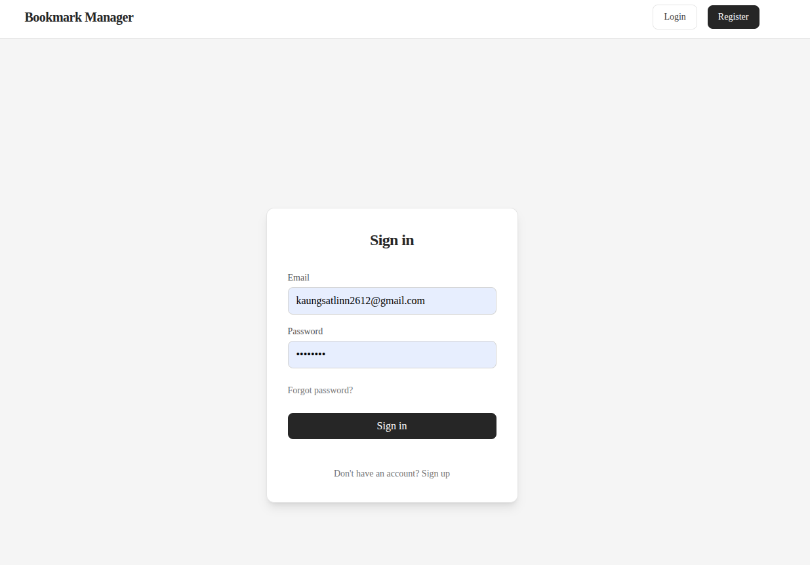
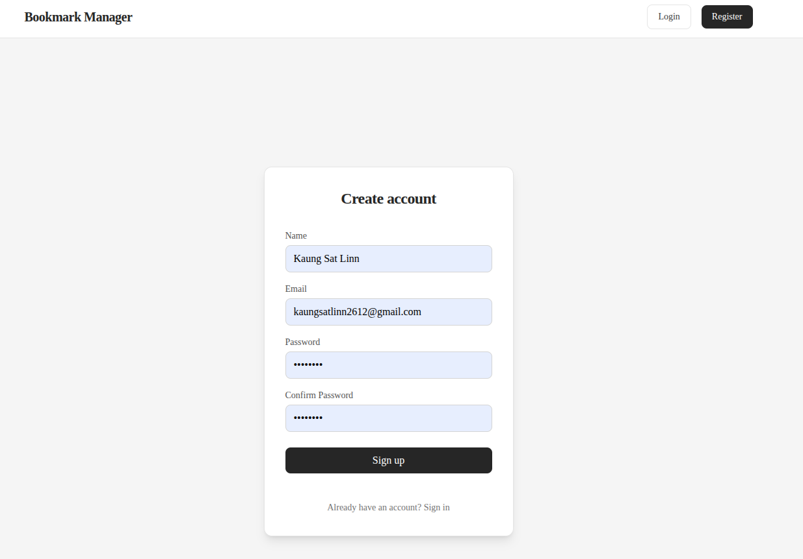
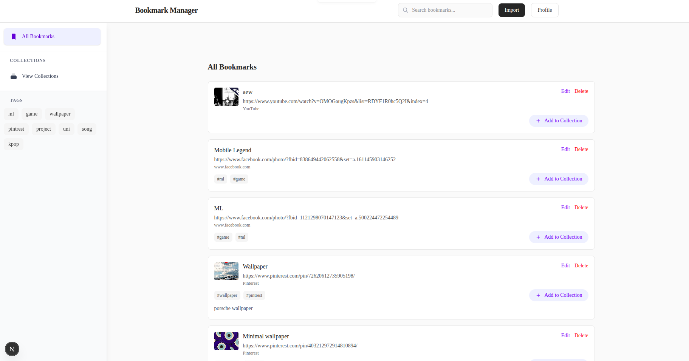
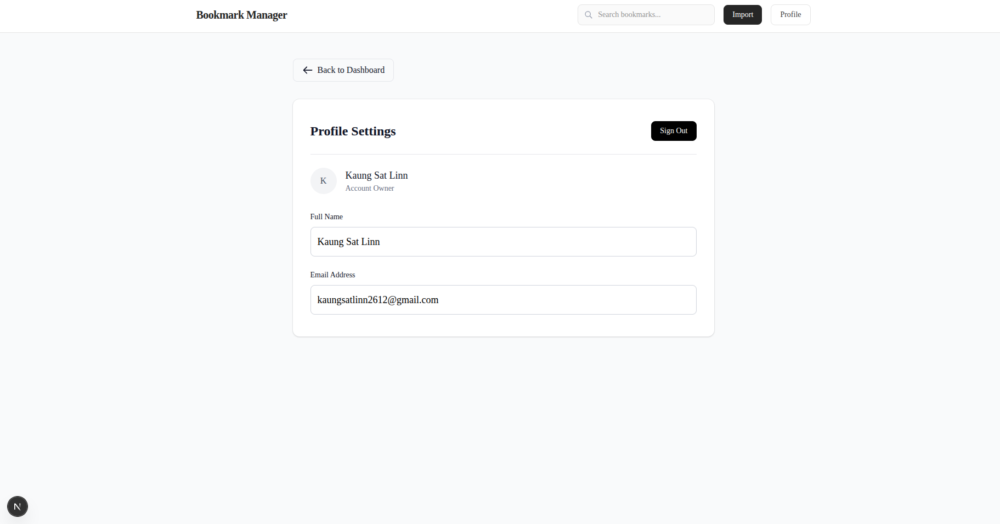
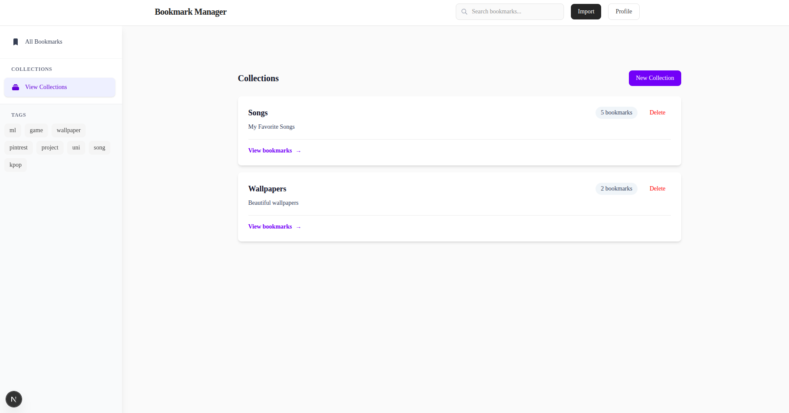
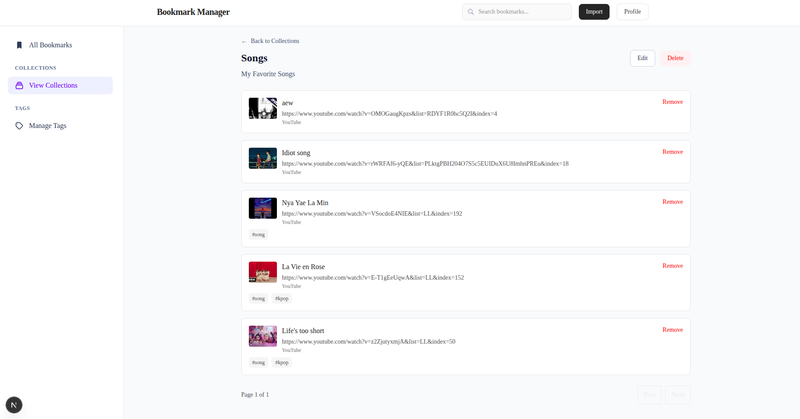
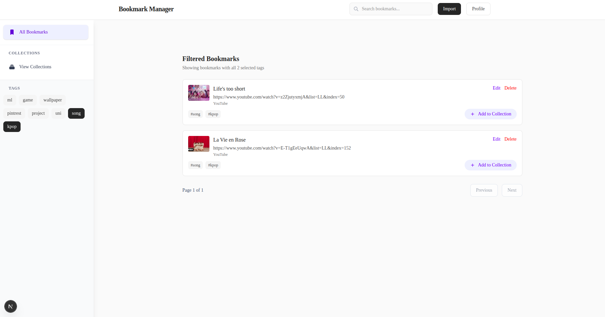

# Bookmark Manager

A modern web application for managing and organizing your bookmarks with tags and collections. Built with Next.js, Express, and MongoDB.

# Member

Kaung Sat Linn 6520053

## Features

- 🔐 User Authentication & Authorization
- 📑 Bookmark Management
  - Add, edit, and delete bookmarks
  - Automatic metadata fetching (title, description, favicon)
  - Notes and descriptions for bookmarks
- 🏷️ Tag System
  - Add tags to bookmarks
  - Filter bookmarks by multiple tags 
  - Tag-based organization
- 📁 Collections
  - Group bookmarks into collections
  - Manage and organize collections
- 🔍 Search Functionality
  - Search across bookmarks
  - Search through titles, URLs, and notes

## Tech Stack

### Frontend
- Next.js
- TypeScript
- Tailwind CSS

### Backend
- Express.js
- MongoDB with Mongoose
- JWT for authentication

## Project Structure

```
bookmark-manager/
├── frontend/               # Next.js frontend application
│   ├── src/
│   │   ├── app/           # App router pages
│   │   ├── components/    # React components
│   │   ├── contexts/      # React contexts
│   │   └── lib/          # Utility functions
│   └── public/           # Static assets
└── backend/              # Express.js backend server
    ├── models/          # Mongoose models
    ├── routes/          # API routes
    ├── middleware/      # Custom middleware
    └── utils/          # Utility functions
```

## Features in Detail

### Authentication
- Email-based registration
- JWT-based authentication
- Password reset functionality
- Email verification

### Bookmark Management
- Import bookmarks with automatic metadata fetching
- Add notes and descriptions
- Organize with tags and collections
- Bulk actions support

### Search and Filter
- Real-time search functionality
- Advanced filtering with multiple tags
- Collection-based filtering


## Screenshots










## API Documentation

All API endpoints are prefixed with `/api`. Authentication is required for most endpoints and uses JWT tokens in the Authorization header.

### 1. Authentication

#### Register
- **Route**: `/api/users/register`
- **Method**: POST
- **Payload**:
  ```json
  {
    "email": "string",
    "password": "string"
  }
  ```
- **Return**:
  ```json
  {
    "token": "string",
    "user": {
      "_id": "string",
      "email": "string"
    }
  }
  ```
- **File**: `/routes/users.js`
- **Test**: `curl -X POST http://localhost:3000/api/users/register`

#### Login
- **Route**: `/api/users/login`
- **Method**: POST
- **Payload**:
  ```json
  {
    "email": "string",
    "password": "string"
  }
  ```
- **Return**:
  ```json
  {
    "token": "string",
    "user": {
      "_id": "string",
      "email": "string"
    }
  }
  ```
- **File**: `/routes/users.js`
- **Test**: `curl -X POST http://localhost:3000/api/users/login`

### 2. Bookmarks

#### Get Bookmarks by Tag
- **Route**: `/api/bookmarks/by-tag/:tagIds`
- **Method**: GET
- **Payload**: `-`
- **Return**:
  ```json
  {
    "items": [
      {
        "_id": "string",
        "title": "string",
        "url": "string",
        "tags": [
          {
            "_id": "string",
            "name": "string"
          }
        ],
        "note": "string",
        "createdAt": "Date"
      }
    ],
    "total": "number",
    "page": "number",
    "pages": "number"
  }
  ```
- **File**: `/routes/bookmarks.js`
- **Test**: `curl http://localhost:3000/api/bookmarks/by-tag/tag1,tag2`

#### Get All Bookmarks
- **Route**: `/api/bookmarks`
- **Method**: GET
- **Payload**: `-`
- **Return**:
  ```json
  {
    "items": [
      {
        "_id": "string",
        "title": "string",
        "url": "string",
        "tags": [
          {
            "_id": "string",
            "name": "string"
          }
        ],
        "note": "string",
        "createdAt": "Date"
      }
    ],
    "total": "number",
    "page": "number",
    "pages": "number"
  }
  ```
- **File**: `/routes/bookmarks.js`
- **Test**: `curl http://localhost:3000/api/bookmarks`

#### Create Bookmark
- **Route**: `/api/bookmarks`
- **Method**: POST
- **Payload**:
  ```json
  {
    "title": "string",
    "url": "string",
    "note": "string",
    "tags": ["string"],
    "collectionId": "string"
  }
  ```
- **Return**: Bookmark object
- **File**: `/routes/bookmarks.js`
- **Test**: `curl -X POST http://localhost:3000/api/bookmarks`

### 3. Tags

#### Delete Tag
- **Route**: `/api/tags/:id`
- **Method**: DELETE
- **Payload**: `-`
- **Return**:
  ```json
  {
    "message": "string"
  }
  ```
- **File**: `/routes/tags.js`
- **Test**: `curl -X DELETE http://localhost:3000/api/tags/:id`

#### Get All Tags
- **Route**: `/api/tags`
- **Method**: GET
- **Payload**: `-`
- **Return**:
  ```json
  [
    {
      "_id": "string",
      "name": "string"
    }
  ]
  ```
- **File**: `/routes/tags.js`
- **Test**: `curl http://localhost:3000/api/tags`

### 4. Collections

#### Create Collection
- **Route**: `/api/collections`
- **Method**: POST
- **Payload**:
  ```json
  {
    "name": "string"
  }
  ```
- **Return**:
  ```json
  {
    "_id": "string",
    "name": "string",
    "userId": "string",
    "createdAt": "Date",
    "updatedAt": "Date"
  }
  ```
- **File**: `/routes/collections.js`
- **Test**: `curl -X POST http://localhost:3000/api/collections`

#### Update Collection
- **Route**: `/api/collections/:id`
- **Method**: PUT
- **Payload**:
  ```json
  {
    "name": "string"
  }
  ```
- **Return**:
  ```json
  {
    "_id": "string",
    "name": "string",
    "userId": "string",
    "createdAt": "Date",
    "updatedAt": "Date"
  }
  ```
- **File**: `/routes/collections.js`
- **Test**: `curl -X PUT http://localhost:3000/api/collections/:id`

#### Delete Collection
- **Route**: `/api/collections/:id`
- **Method**: DELETE
- **Payload**: `-`
- **Return**:
  ```json
  {
    "message": "string"
  }
  ```
- **File**: `/routes/collections.js`
- **Test**: `curl -X DELETE http://localhost:3000/api/collections/:id`

#### Get All Collections
- **Route**: `/api/collections`
- **Method**: GET
- **Payload**: `-`
- **Return**:
  ```json
  [
    {
      "_id": "string",
      "name": "string",
      "bookmarkCount": "number"
    }
  ]
  ```
- **File**: `/routes/collections.js`
- **Test**: `curl http://localhost:3000/api/collections`
